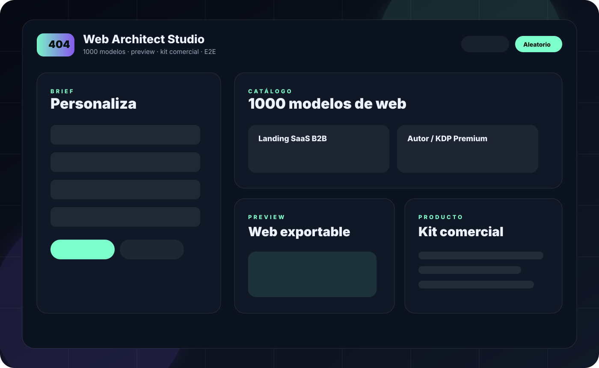
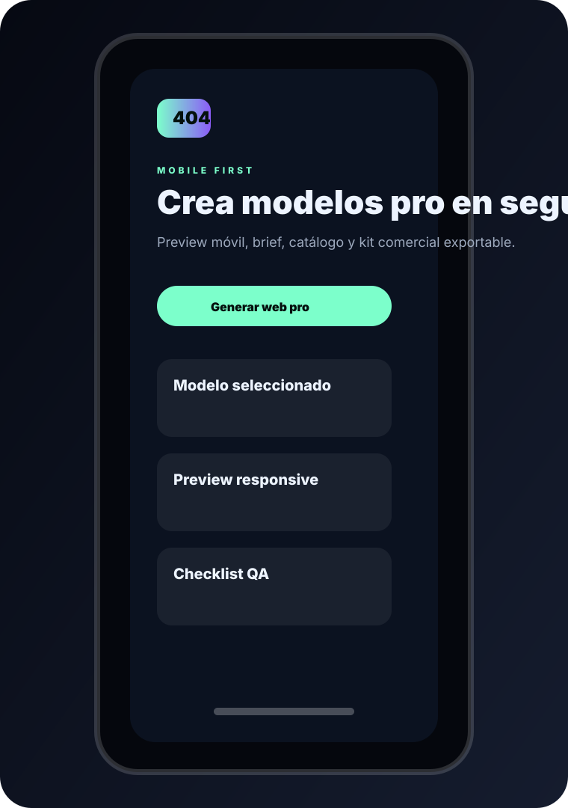

# 404 Web Architect Pro

Generador estático/offline de modelos profesionales de páginas web. Incluye **1000 presets locales**, filtros, brief editable, preview desktop/móvil, auditoría automática, **kit comercial exportable**, salida HTML/JSON/Markdown y pruebas E2E con Playwright.



## Demo móvil



## Qué problema resuelve

404 Web Architect Pro sirve para pasar de una idea vaga a una propuesta web accionable: estructura, copy base, secciones, CTA, KPIs, checklist QA y landing HTML exportable. Está pensado para escritores, apps, SaaS, portfolios, productos, restaurantes, hoteles, dashboards, comunidades y proyectos indie.

## Qué incluye

- 1000 modelos locales de web.
- 50 categorías profesionales.
- 20 estilos visuales.
- Buscador con normalización de tildes, filtros y orden por puntuación.
- Brief editable: marca, oferta, público, CTA, tono e intensidad visual.
- Preview responsive en desktop/móvil.
- **Kit comercial** con posicionamiento, copy base, arquitectura, plan de producción, KPIs y checklist QA.
- Auditoría automática de arquitectura, UX, accesibilidad, seguridad, rendimiento y GitHub.
- Exportación a HTML, JSON y Markdown.
- Copia de prompt profesional para usar en ChatGPT, Claude o Gemini.
- Sin dependencias externas en producción.
- Compatible con GitHub Pages.
- Validación local, GitHub Actions y test E2E Playwright.

## Uso rápido

Abre `index.html` directamente en el navegador o súbelo a GitHub Pages. La app funciona sin servidor, sin backend y sin llamadas a internet.

## Validación local

```bash
npm install
npm test
```

Comprueba:

- 1000 modelos exactos.
- 50 categorías y 20 estilos.
- IDs y slugs únicos.
- Campos obligatorios completos.
- Paletas hexadecimales seguras.
- Tags sin duplicados.
- Presencia de checks críticos de móvil, accesibilidad, seguridad, producto y GitHub.

## Pruebas E2E reales

```bash
npm install
npx playwright install chromium
npm run test:e2e
```

Cubren:

- Carga inicial y catálogo de 1000 modelos.
- Búsqueda, selección y actualización del brief.
- Preview móvil sin scroll horizontal.
- Descarga HTML, JSON y kit Markdown.
- Estados accesibles `aria-pressed`.

## Publicar en GitHub Pages

1. Crea un repositorio nuevo.
2. Sube todos los archivos, incluida la carpeta `.github`.
3. En GitHub: **Settings → Pages**.
4. Source: `Deploy from a branch`.
5. Branch: `main` y carpeta `/root`.
6. Guarda y espera a que GitHub publique la web.

## Estructura

```txt
404-web-architect-pro/
├─ index.html
├─ styles.css
├─ app.js
├─ models.js
├─ package.json
├─ README.md
├─ LICENSE
├─ INFORME_FINAL.md
├─ QUALITY_GATE.md
├─ SECURITY.md
├─ CHANGELOG.md
├─ CONTRIBUTING.md
├─ playwright.config.js
├─ demo/
│  ├─ desktop-preview.svg
│  └─ mobile-preview.svg
├─ tests/
│  └─ e2e/
│     └─ commercial.spec.js
├─ tools/
│  ├─ validate-models.mjs
│  └─ validate-app.mjs
└─ .github/
   └─ workflows/
      └─ validate.yml
```

## Riesgos pendientes honestos

- Los 1000 modelos son presets generados y curados por categoría/estilo, no plantillas visuales diseñadas manualmente una a una.
- La exportación crea una landing HTML completa, no un proyecto React/Vue/Next.
- Para un 10/10 comercial real de mercado aún conviene hacer playtesting humano largo, métricas de conversión reales y revisión manual de copy por nicho.

## Licencia

MIT.
